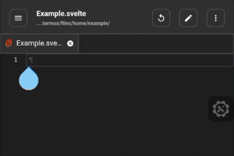

Svelte Completer for Acode

A lightweight Acode plugin that provides auto-completion for Svelte components, directives, and APIs into your Svelte or SvelteKit project.

---

🚀 Usage

1. Open any .svelte file.

2. The plugin will automatically detect that you are in a Svelte project and activate the Svelte completer.

3. Start typing in the editor, and you’ll see Svelte-specific completions.

Preview:

---

🌟 Features

###### Automatic Detection
* Activates only in any .svelte files, minimizing the performance impact.
* Specific completers such as Javascript/Typescript only activates on their appropriate tags.

###### Silent & Lightweight
Runs in the background without interfering with the core editor features.

---

🛠️ Development and Contribution

Feel free to fork this repository and submit pull requests.

Github Repository: [https://github.com/Kanester/svelteAutocomplete](https://github.com/Kanester/svelteAutocomplete)

---

[!] Desclaimer
This is currently under development with limited scope; might be unstable anytime.

---

⚖️ License

MIT © KnxTr
